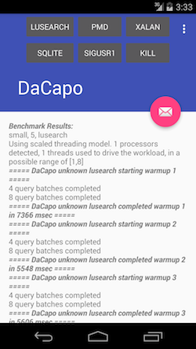

# Android Etalon - DaCapo
Etalon-DaCapo is a port of a set of [DaCapo Java Benchmark ](http://www.dacapobench.org/) to Android devices.
Since some Java libraries are not fully supported on Android and some others packages are completely left out, we ported only four applications:

		1. lusearch
		2. xalan
		3. pmd
		4. hsqldb (sqlite)

The port is intended to be generic, and configurable to serve as a tool for Mobile benchmarking by the system developers.



## How this is useful?
Unlike all the other mobile benchmarks, this benchmark suite focuses on high level performance of the runtime (Virtual Machine).
The ability to execute deterministic workload without environmental effect (GPS, WiFI, etc..) allows the system developers to analyse the main system performance.

### Running
From command line execute: 

~~~shell
./runapp.sh
~~~

The script takes care of copying the data folder to the external storage of the device as well as installing the apk file.

## Related Publications

* Hussein, A., Payer, M., Hosking, A. L., and Vick, C. A. (2015). Impact of GC Design on Power and Performance for Android. *In ACM International Systems and Storage Conference*. doi:10.1145/2757667.2757674.
* Hussein, A., Hosking, A. L., Payer, M., and Vick, C. A. (2015). Don’t Race the Memory Bus: Taming the GC Leadfoot. *In ACM SIGPLAN International Symposium on Memory Management*. doi:10.1145/2754169.2754182

## License

```
Copyright 2016 Purdue University.

Licensed under the Apache License, Version 2.0 (the "License");
you may not use this file except in compliance with the License.
You may obtain a copy of the License at

    http://www.apache.org/licenses/LICENSE-2.0

Unless required by applicable law or agreed to in writing, software
distributed under the License is distributed on an "AS IS" BASIS,
WITHOUT WARRANTIES OR CONDITIONS OF ANY KIND, either express or implied.
See the License for the specific language governing permissions and
limitations under the License.
```